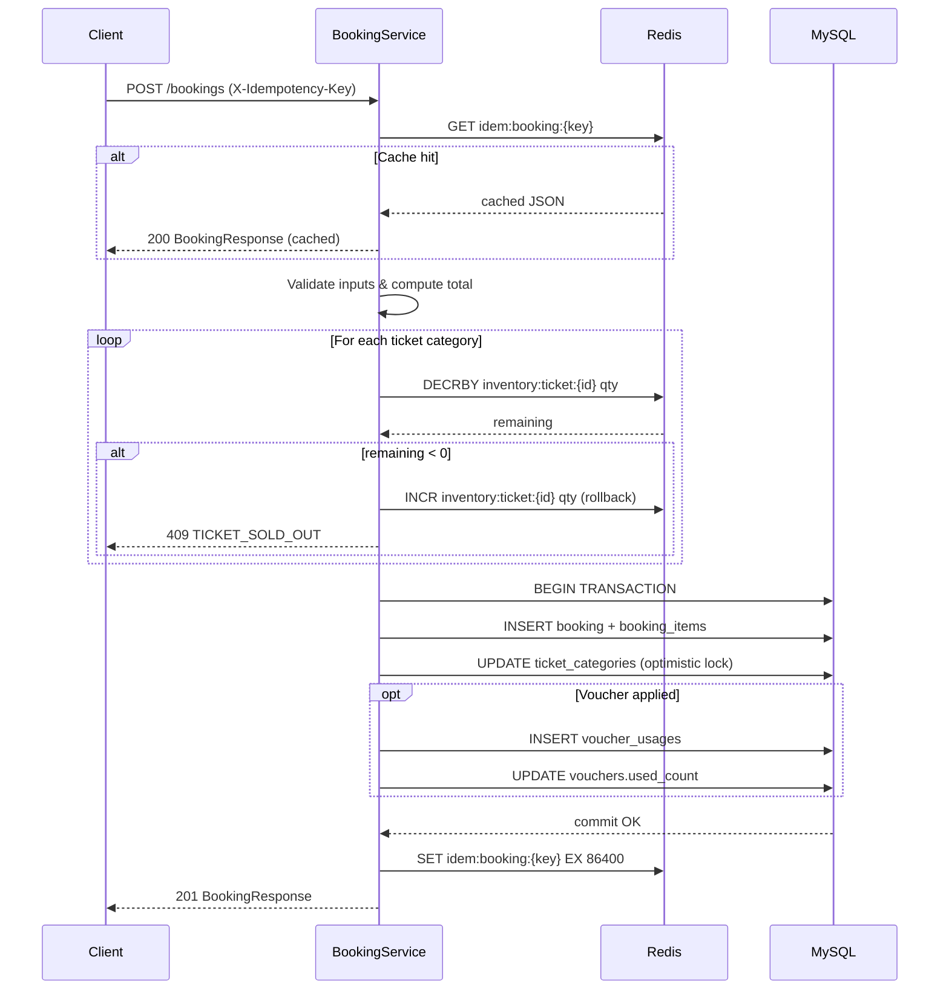

# System Design

## Architecture Overview

```
┌─────────────────────────────────────────────────────────────┐
│                        Client (HTTP)                        │
└──────────────────────────┬──────────────────────────────────┘
                           │ REST / JSON
┌──────────────────────────▼──────────────────────────────────┐
│                    Spring Boot App                          │
│                                                             │
│  ┌──────────────┐  ┌──────────────┐  ┌──────────────────┐  │
│  │  Auth Filter  │  │  Controllers │  │  GlobalException  │  │
│  │  (JWT)       │  │  (REST)      │  │  Handler          │  │
│  └──────┬───────┘  └──────┬───────┘  └──────────────────┘  │
│         │                 │                                  │
│         └────────┬────────┘                                 │
│                  ▼                                           │
│  ┌───────────────────────────────────────────────────────┐  │
│  │                   Service Layer                        │  │
│  │  BookingService │ ConcertService │ VoucherService …   │  │
│  └───────────────────────────────────────────────────────┘  │
│          │                     │                             │
│  ┌───────▼──────┐    ┌─────────▼────────┐                   │
│  │  Repository  │    │  RedisTemplate   │                   │
│  │  (JPA/MySQL) │    │  (Inventory,     │                   │
│  └───────┬──────┘    │   Idempotency)   │                   │
│          │           └─────────┬────────┘                   │
└──────────┼─────────────────────┼───────────────────────────┘
           │                     │
  ┌────────▼──────┐    ┌─────────▼──────┐
  │   MySQL 8     │    │   Redis 7      │
  │  (source of   │    │  (fast path,   │
  │   truth)      │    │   cache)       │
  └───────────────┘    └────────────────┘
```

**Layer responsibilities:**

| Layer | Responsibility |
|---|---|
| `Controller` | Parse HTTP input, extract `userId` from `SecurityContext`, delegate to Service, return `ResponseEntity<ApiResponse<T>>` |
| `Service` | Business logic, Redis interactions, `@Transactional` boundaries |
| `Repository` | JPA queries against MySQL; no business logic |
| `Redis` | Inventory counters, idempotency cache, (future) voucher locks |
| `GlobalExceptionHandler` | Catches `AppException` and Spring validation errors; maps to consistent `ApiResponse.error()` |

---

## Technology Stack & Rationale

| Technology | Version | Reason | Alternative Considered |
|---|---|---|---|
| Spring Boot | 3.2.5 | Standard for Java REST APIs; auto-configuration, rich ecosystem | Micronaut — less team familiarity for rapid development |
| MySQL 8 | 8.x | ACID transactions, mature, well-supported on Docker | PostgreSQL — equivalent capability; MySQL more common in Vietnamese startup stacks |
| Flyway | bundled | Versioned, reproducible schema migrations; avoids ORM DDL pitfalls | Liquibase — more verbose; Flyway simpler for this scale |
| Redis 7 | 7.x | Sub-millisecond atomic operations (`DECRBY`) for inventory; TTL-native for idempotency cache | Memcached — no atomic counters; Hazelcast — heavier operational footprint |
| JWT (jjwt 0.12) | 0.12 | Stateless auth, no server-side session store required | Spring Session + Redis — adds operational complexity without benefit at this scale |
| Hibernate (JPA) | bundled | Reduces boilerplate; `@Version` provides optimistic locking out of the box | MyBatis — more SQL control but more verbose |
| Docker Compose | v2 | One-command local environment with MySQL + Redis + app | Manual setup — not reproducible across machines |

---

## Flash Sale Design

### The Problem

During a flash sale, hundreds of concurrent requests attempt to book the same ticket categories simultaneously. A naive DB-read-then-write pattern creates race conditions that result in overselling.

### Redis Inventory Counter Flow

When a concert is published, each ticket category's available quantity is loaded into Redis:

```
Key pattern:  inventory:ticket:{categoryId}
Value:        integer (available count)
```

**Booking request flow (per ticket category item):**

```
1. Client sends POST /bookings with X-Idempotency-Key

2. [Idempotency check]
   GET idem:booking:{key}
   → if hit: return cached BookingResponse (HTTP 200)
   → if miss: continue

3. [Input validation]
   - Concert is PUBLISHED
   - Each category exists and quantity ≤ maxPerBooking

4. [Calculate totalAmount from category prices]

5. [Voucher validation] (optional)
   - Validate code, expiry, usedCount, minOrderAmount, user uniqueness
   - Compute discountAmount

6. [Redis inventory decrement — atomic fast path]
   for each item:
     remaining = DECRBY inventory:ticket:{id} quantity
     if remaining < 0:
       INCR inventory:ticket:{id} quantity   ← rollback this item
       rollback all previously decremented items
       throw TICKET_SOLD_OUT

7. [@Transactional DB write]
   - INSERT bookings (status=PENDING, expiresAt=now+15min)
   - INSERT booking_items
   - UPDATE ticket_categories SET available_quantity -= qty  ← optimistic lock via @Version
   - If voucherCode: INSERT voucher_usages, UPDATE vouchers.used_count
   - On DataIntegrityViolationException (idempotency_key conflict): throw BOOKING_ALREADY_EXISTS
   - On ObjectOptimisticLockingFailureException: throw INSUFFICIENT_INVENTORY

8. [Suspicious detection — non-blocking]
   count bookings by userId WHERE createdAt > now-5min
   if count > 3: SET booking.isSuspicious = true

9. [Cache idempotency response]
   SET idem:booking:{key} <BookingResponse JSON> EX 86400
```

### Sequence Diagram



### Trade-offs: Redis-first vs. DB-only Locking

| Approach | Pros | Cons |
|---|---|---|
| **Redis DECRBY (chosen)** | Sub-millisecond; only winners reach MySQL; prevents write storm | Redis failure requires graceful degradation; inventory can drift if app crashes after DECRBY but before DB commit |
| Pessimistic DB lock (`SELECT FOR UPDATE`) | Strong consistency; no external dependency | All concurrent requests serialize on the DB lock; connection pool exhaustion under flash-sale load |
| Optimistic DB lock (`@Version`) | No lock contention; simple to implement | High retry rate under contention; poor UX at 500 req/min |

**Chosen approach**: Redis DECRBY as the primary gate + `@Version` optimistic lock as the DB safety net. This provides low latency for the common case while preserving correctness even if Redis returns stale or incorrect data.

**Inventory drift mitigation**: If the app crashes after a successful `DECRBY` but before the DB commit, Redis inventory is decremented but the DB is not. This creates a small window of phantom "sold" tickets. The `available_quantity` in MySQL remains the source of truth for reconciliation. A periodic sync job (not yet implemented) can detect and correct drift.

---

## Key Design Decisions

### Monolith vs. Microservices

**Decision: Monolith with package-by-feature structure.**

| Factor | Reasoning |
|---|---|
| Timeline | 48-hour build window; microservices would require service mesh, distributed tracing, API gateway — all undifferentiated infrastructure work |
| Scale | ~50,000 users, 300–500 req/min peak. A single well-tuned Spring Boot app behind a connection pool handles this comfortably |
| Domain complexity | 5 bounded contexts (auth, concert, booking, voucher, ops) fit cleanly in one process when structured by feature package |
| Team size | Solo or small team; microservices coordination overhead (shared schemas, inter-service contracts) hurts velocity |

The package-by-feature structure (`module/booking/`, `module/concert/`, etc.) keeps domain boundaries explicit and makes future extraction to services straightforward if needed.

### Optimistic vs. Pessimistic Locking

**Decision: Optimistic locking (`@Version`) on `ticket_categories`.**

The DB lock is the safety net — Redis handles the majority of contention before it reaches MySQL. Under normal flash-sale conditions, very few requests reach the DB lock path. Optimistic locking avoids holding long-lived row locks that would degrade throughput for legitimate non-conflicting transactions.

### Redis Roles

| Role | Key Pattern | TTL |
|---|---|---|
| Inventory counter | `inventory:ticket:{categoryId}` | None (persistent until concert ends) |
| Idempotency cache | `idem:booking:{idempotencyKey}` | 24 hours |
| *(Future)* Voucher lock | `voucher:lock:{voucherId}:{userId}` | 5 seconds |

The idempotency cache stores a serialised `BookingResponse` JSON so identical retries receive the exact same response without re-executing business logic.

---

## Database Indexing Strategy

```sql
-- Users
CREATE UNIQUE INDEX idx_users_email ON users(email);
-- Fast lookup during login/token validation

-- Concerts
CREATE INDEX idx_concerts_status ON concerts(status);
-- Filters PUBLISHED concerts for customer listing endpoint

-- Bookings (most query-heavy table)
CREATE UNIQUE INDEX idx_bookings_idempotency_key ON bookings(idempotency_key);
-- Prevents duplicate booking at DB level (double-safety after Redis)

CREATE INDEX idx_bookings_user_id ON bookings(user_id);
-- GET /bookings (customer own bookings)

CREATE INDEX idx_bookings_concert_id ON bookings(concert_id);
-- Ops filter by concert

CREATE INDEX idx_bookings_status ON bookings(status);
-- Ops filter by status; scheduler queries PENDING/WAITING_PAYMENT

CREATE INDEX idx_bookings_expires_at ON bookings(expires_at);
-- Scheduler: WHERE expires_at < NOW() AND status IN (...)

CREATE INDEX idx_bookings_suspicious ON bookings(is_suspicious);
-- GET /ops/bookings/suspicious

-- Voucher usages
CREATE UNIQUE INDEX idx_voucher_usages_voucher_user ON voucher_usages(voucher_id, user_id);
-- Prevents one user using same voucher twice; core correctness guarantee

-- Ticket categories
CREATE INDEX idx_ticket_categories_concert_id ON ticket_categories(concert_id);
-- Concert detail page loads all categories for a concert
```

The `@Version` column on `ticket_categories` is used exclusively by Hibernate's optimistic locking mechanism — it does not require a separate index.
